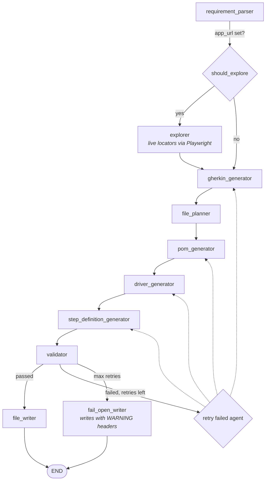

# ScenarioAI

**AI-powered BDD test suite generator.** Give it a plain-English requirement and it produces a complete, validated [Behave](https://behave.readthedocs.io/) test suite — Gherkin feature files, Page Object Models, driver/helper modules, and step definitions — using a multi-agent [LangGraph](https://langchain-ai.github.io/langgraph/) pipeline.

It runs locally against [Ollama](https://ollama.com/) or against the OpenAI API, and ships with GitHub Actions that generate tests on demand and even apply reviewer feedback automatically.

---

## What it does

Given a requirement like:

> _"Users log in with email and password. Valid credentials redirect to the dashboard; invalid ones show 'Invalid email or password'. After 5 failed attempts the account locks."_

ScenarioAI generates a ready-to-run suite under `generated_tests/`:

```
generated_tests/
├── features/            login.feature           # Gherkin scenarios
├── step_definitions/    login_steps.py          # @given/@when/@then bindings
├── pages/               login_page.py            # Page Object Model (no assertions)
└── driver/              login_helper.py          # multi-step flow helpers
```

Every file is **validated before it's written** — static checks plus a real `behave --dry-run` — so you get code that actually parses, imports, and binds.

---

## How it works

The pipeline is a LangGraph state machine. Each stage is an autonomous agent with its own prompt and self-validation.



| Stage | Responsibility |
|-------|----------------|
| **requirement_parser** | Extracts actor / action / preconditions / expected result / edge cases as structured JSON |
| **explorer** _(optional)_ | If `--app-url` is given, drives a headless browser to collect **real** Playwright locators so the POM uses actual selectors instead of guesses |
| **gherkin_generator** | Writes `Feature`/`Scenario`/`Given`/`When`/`Then` |
| **file_planner** | Decides create / insert / overwrite / skip, scans existing files (LangChain tools), and enforces file naming |
| **pom_generator** | Generates a Page Object Model class, then consolidates duplicate methods |
| **driver_generator** | Generates multi-step flow/setup helpers, then consolidates |
| **step_definition_generator** | Binds every Gherkin step to POM/driver calls (uses signatures only, for token efficiency) |
| **validator** | Two-phase validation (see below) |
| **file_writer** / **fail_open_writer** | Writes files to `generated_tests/` (with a path-traversal guard). Fail-open writes anyway with warning headers so reviewers can fix them |

### Two-phase validation

- **Phase 1 — fast, in-process:** Gherkin parse, Python AST syntax, POM/step "purity" (no assertions in page objects, no raw Playwright in steps), step coverage, POM/driver method-existence cross-checks, and `ruff` linting.
- **Phase 2 — real run:** Assembles the suite in a temp directory and runs `behave --dry-run` to confirm everything imports and every step binds.

On failure the graph **routes back to the agent responsible** and retries up to `MAX_RETRIES`. After that it **fails open** — writing the files with a `WARNING` header so a human can review and fix them rather than getting nothing.

---

## Project structure

```
src/
├── main.py                  # CLI + run() pipeline entry point
├── config.py                # pydantic-settings (reads .env / env vars)
├── cli/                     # auxiliary CLI entry points
│   ├── review.py            #   apply one inline comment to one file
│   └── apply_review.py      #   apply all comments from a PR review
├── agents/
│   ├── base.py              # BaseAgent: shared LLM client + fence stripping
│   ├── explorer.py  requirement_parser.py  gherkin_generator.py
│   ├── file_planner.py  pom_generator.py  driver_generator.py
│   ├── stepdefinition_generator.py  validator.py  file_writer.py
│   └── review_agent.py
├── core/
│   ├── llm_client.py        # provider factory (Ollama | OpenAI)
│   ├── text.py              # strip_code_fences / normalize helpers
│   ├── exceptions.py  logger.py
├── graph/workflow.py        # build_graph(): wires the StateGraph
├── models/state.py          # ScenarioAIState + typed dicts
├── prompts/                 # system prompts, one per agent
├── tools/file_planner_tools.py
└── utils/                   # file_scanner.py, file_types.py

tests/                       # pytest (validator + llm_client)
.github/workflows/           # ci.yml, generate-tests.yml, review-feedback.yml
```

---

## Requirements

- **Python 3.12+**
- **[uv](https://docs.astral.sh/uv/)** for dependency management
- An **LLM provider**: a local [Ollama](https://ollama.com/) instance _or_ an OpenAI API key
- _(Optional)_ **Playwright** browsers for the explorer: `uv run playwright install chromium`

`ruff` and `behave` are regular dependencies because the validator invokes them at runtime.

---

## Installation

```bash
# Clone, then install everything (main deps + dev tools)
uv sync --dev

# Copy the env template and fill it in
cp .env.example .env
```

---

## Configuration

All settings come from environment variables or `.env` (see `.env.example`):

| Variable | Default | Description |
|----------|---------|-------------|
| `LLM_PROVIDER` | `ollama` | `ollama` (local, no key) or `openai` |
| `LLM_MODEL` | `qwen2.5` | Model name for the chosen provider |
| `LLM_TEMPERATURE` | `0.0` | Sampling temperature |
| `OPENAI_API_KEY` | — | Required when `LLM_PROVIDER=openai` |
| `MAX_RETRIES` | `2` | Validation retry attempts before fail-open |
| `OUTPUT_DIR` | `generated_tests` | Where generated files land |
| `LANGCHAIN_TRACING_V2` | `false` | Enable LangSmith tracing |
| `LANGCHAIN_API_KEY` / `LANGCHAIN_PROJECT` | — | LangSmith config |

> CI and GitHub Actions runners can't reach a local Ollama, so they use `LLM_PROVIDER=openai` with `OPENAI_API_KEY` from repository secrets.

---

## Usage

### Generate a suite from a requirement

```bash
uv run python -m src.main --requirement "Users can reset their password via an email link"
```

### Use real locators from a running app

Point the explorer at a live URL and it will collect actual selectors:

```bash
uv run python -m src.main \
  --requirement "Users log in with email and password" \
  --app-url http://localhost:3000/login
```

Run with no `--requirement` to use the built-in demo login requirement.

The process exits non-zero if validation fails (unless it fell open), which is how the CI/generation workflow knows whether to open the PR.

---

## GitHub Actions

| Workflow | Trigger | What it does |
|----------|---------|--------------|
| **`ci.yml`** | push / PR | `ruff check` + `pytest` |
| **`generate-tests.yml`** | manual dispatch | Runs the pipeline for a requirement, commits to a new branch, opens a **draft PR**, and adds a reviewer |
| **`review-feedback.yml`** | PR review "Request changes" | Collects all inline comments, groups them by file, applies fixes via `ReviewAgent` in one commit, and re-requests review |

This closes the loop: describe a feature → get a draft PR → leave inline comments → the bot applies them → re-review.

---

## Development

```bash
uv sync --dev               # install with dev tooling
uv run pytest tests/ -v     # run the test suite
uv run ruff check src/      # lint
```

### Design notes

- **Provider factory** (`core/llm_client.py`) lazily imports only the selected provider, so you don't need `langchain-openai` installed to run on Ollama.
- **`BaseAgent`** gives every LLM agent a shared, **injected** `LLMClient` (one provider handshake for the whole graph) and a common code-fence stripping helper.
- **Typed state** (`models/state.py`) — a single `ScenarioAIState` `TypedDict` flows through the graph; reducers (`operator.add`) accumulate errors and retry counts.
- **Fail-open by design** — partial output a human can fix beats a hard failure with nothing to show.
